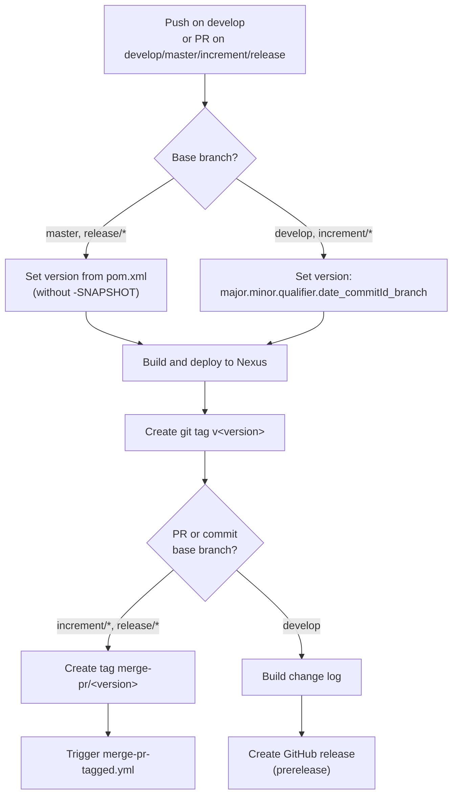
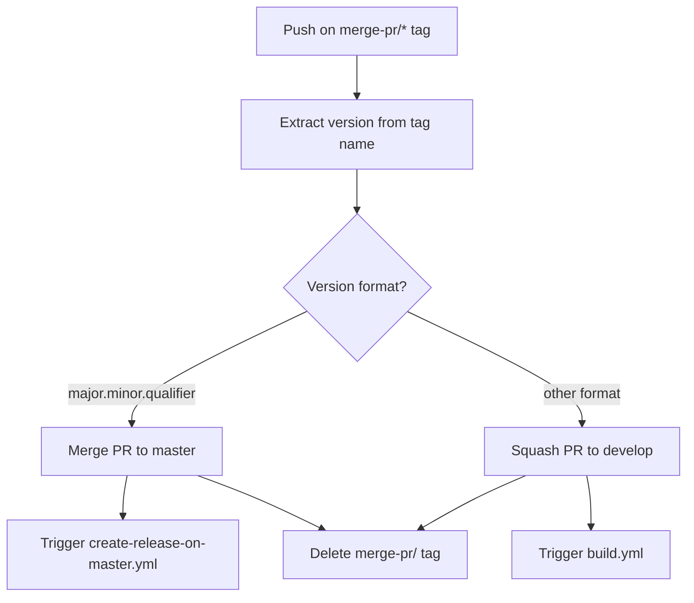
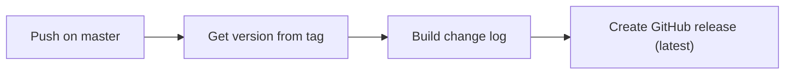
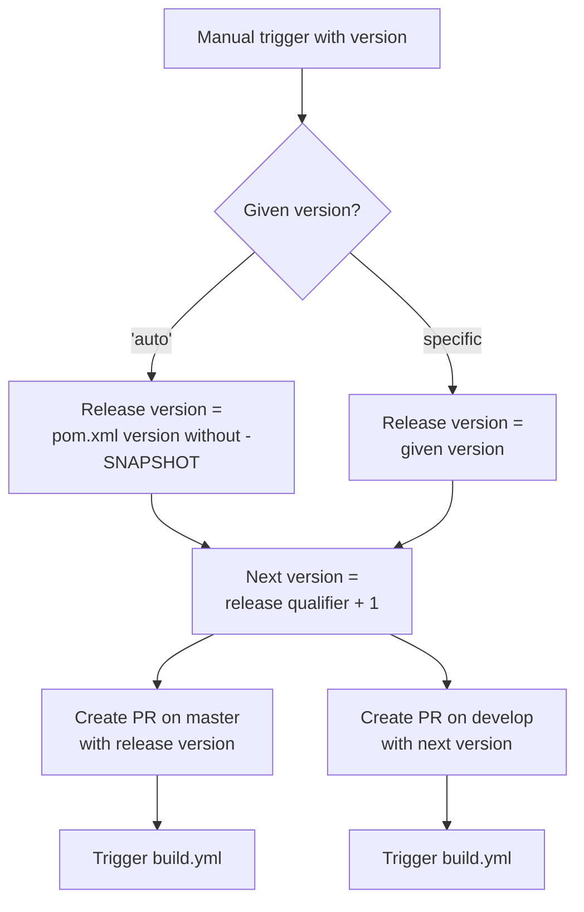

# Development Version and Branch Handling

## Branches

The JUDO NG versioning policy is based on [GitFlow](https://www.atlassian.com/git/tutorials/comparing-workflows/gitflow-workflow). Each branch type serves a specific purpose in the development lifecycle:

| Branch Pattern | Purpose | Based On |
|---------------|---------|----------|
| `develop` | Latest development sources of the active version | — |
| `feature/JNG-NUMBER_summary` | New features for the active version | `develop` |
| `(release/)X.Y.Z` | Release candidate stabilization | `develop` |
| `bugfix/JNG-NUMBER_summary` | Fixes applied during release testing | release branch |
| `support/JNG-NUMBER_summary` | Minor updates to a previous release | release branch |
| `master` | Latest released sources | merged from release |
| `hotfix/JNG-NUMBER_summary` | Emergency fixes to production | `master` |

> **Note:** Bugfix and support branch changes must be applied to both the release branch and newer development branches.

```mermaid
gitGraph
    commit id: "init"
    branch develop
    checkout develop
    commit id: "dev-1"
    branch feature/JNG-1
    commit id: "feat-1"
    commit id: "feat-2"
    checkout develop
    merge feature/JNG-1 id: "merge-feat-1"
    branch feature/JNG-3
    commit id: "feat-3"
    checkout develop
    merge feature/JNG-3 id: "merge-feat-3"
    branch release/1.0-beta1
    commit id: "rc-1"
    branch bugfix/JNG-4
    commit id: "fix-1"
    checkout release/1.0-beta1
    merge bugfix/JNG-4 id: "merge-fix"
    checkout develop
    merge release/1.0-beta1 id: "merge-release"
    checkout master
    merge release/1.0-beta1 id: "v1.0"
```

## Version Numbers

Version numbers follow semantic versioning with these rules:

| Event | Version Change |
|-------|---------------|
| Starting a `feature/` branch | No change |
| Starting a release branch from `develop` | 2nd number incremented on `develop` |
| Starting a `bugfix/` branch | No change (applied on release branches before merge to master) |
| Starting a `support/` branch | 3rd number incremented |
| Starting a `hotfix/` branch | 4th number incremented |

## GitHub Actions Workflows

The CI/CD pipeline consists of several interconnected workflows:

### build.yml — Main Build Pipeline

Triggered on push to `develop` or pull requests targeting `develop`, `master`, `increment/*`, or `release/*` branches.



### merge-pr-tagged.yml — Post-Merge Handler

Triggered when a `merge-pr/*` tag is pushed. Determines whether to merge to `master` (for release versions) or squash to `develop`.



### create-release-on-master.yml — Release Creation

Triggered on push to `master`. Creates a GitHub release with a generated changelog.



### release.yml — Manual Release Pipeline

Manually triggered with a version parameter (either `'auto'` or a specific `major.minor.qualifier`).



## Development Rules

> **Important:** There is no commit without a ticket number. Every pull request and commit must include a JIRA ticket reference in the format `JNG-xxx`.

Issue tracking is managed via [JIRA](https://blackbelt.atlassian.net/jira/dashboards).
