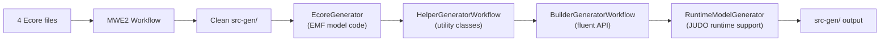
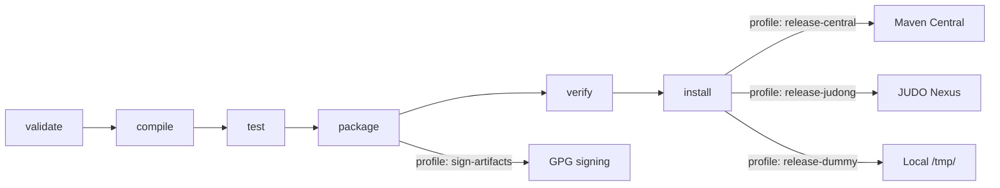

# Contributing to JUDO

## Development Requirements

Your development environment must match the requirements described in the parent project's [CONTRIBUTING guide](https://github.com/BlackBeltTechnology/judo-community/blob/develop/CONTRIBUTING.adoc):

- **Java:** JDK 21
- **Maven:** 3.9.4+
- **Build tooling:** Tycho 4.0.13 (for Eclipse plugin builds)

## Code Structure

This project uses Maven with Tycho for Eclipse-flavored builds. Modules are grouped into three layers:

### Model Modules

| Module | Purpose |
|--------|---------|
| `model/` | Eclipse plugin containing the Ecore metamodel definitions, EMF-generated Java code (`src-gen/`), and hand-written runtime support code (`src/main/java/`) |
| `model-test/` | JUnit 5 unit tests for model validation, utilities, incremental transformations, and execution context |

### OSGi Modules

| Module | Purpose |
|--------|---------|
| `osgi/` | Repackages the model as an OSGi bundle with additional services (bundle tracking, service registration) for use in transformation pipelines outside Eclipse |
| `osgi-itest/` | Integration tests running inside a Karaf container via Pax Exam |

### Eclipse Packaging

| Module | Purpose |
|--------|---------|
| `feature/` | Eclipse feature definition for installing the plugin |
| `site/` | Eclipse update site — all built versions are compiled here. Versions are encoded in URLs, so a special profile handles version substitution |

To update site category versions:

```sh
mvn clean install -P update-category-versions -f site/pom.xml
```

## Code Generation



The MWE2 workflow at `model/src/workflow/generateModel.mwe2` processes four GenModels:

1. `rdbms.genmodel` — main RDBMS model
2. `rdbms-datatypes.genmodel` — data type mappings
3. `rdbms-namemapping.genmodel` — name mappings
4. `rdbms-tablemappingrules.genmodel` — table mapping rules

Then it generates Helper classes, Builder classes (fluent API), and JUDO RuntimeModel support classes.

> **Warning:** Never manually edit files in `src-gen/` — they are regenerated from Ecore models by the MWE2 workflow.

### Running Code Generation in Eclipse

Required Eclipse features:

- XTend, XText, MWE, MWE2

Use the predefined launcher `Generate JSL.launch`, or run as MWE2 Workflow:

```
hu.blackbelt.judo.meta.rdbms.model project src/workflow/generateModel.mwe2
```

## Working with Eclipse

### Plugin Requirements

- m2e
- Epsilon
- Modeling Tools

### Installation

Go to "Install new software" and add the URL of the P2 site listed on GitHub (or an uncompressed ZIP folder). The plugin contains the metamodel and default editor UI.

## Build Lifecycle



### Maven Profiles

| Profile | Purpose |
|---------|---------|
| `modules` | Activates all submodules (active by default unless `-DskipModules=true`) |
| `sign-artifacts` | GPG-signs built artifacts for release |
| `release-dummy` | Deploys to local `/tmp/` directory for testing |
| `release-judong` | Deploys to internal JUDO Nexus repository |
| `release-central` | Deploys to Maven Central via Sonatype OSSRH |
| `generate-github-asciidoc-diagrams` | Generates documentation diagrams with PlantUML |
| `update-source-code-license` | Updates EPL-2.0 license headers in source files |

## Troubleshooting

### JUnit Tests in Eclipse

Eclipse + Tycho has a classpath issue where JUnit is not included. A `Required-Bundle` entry has been added to the OSGi Manifest as a workaround (not the Tycho-recommended approach). See [Eclipse Bug 534587](https://bugs.eclipse.org/bugs/show_bug.cgi?id=534587).

### Lombok

Tycho does not support Lombok generation directly ([lombok#285](https://github.com/rzwitserloot/lombok/issues/285)). No Lombok is used in Eclipse projects — all source code in those modules is generated.

### Tycho Version Compatibility

Tycho 1.4.0 and below does not handle repository references inside site definitions. All referenced plugin sites must be added manually. See [Eclipse Bug 453708](https://bugs.eclipse.org/bugs/show_bug.cgi?id=453708).

## Version Policy

Maven and Eclipse handle versions differently:

| System | Snapshot Format | Example |
|--------|----------------|---------|
| Maven | `-SNAPSHOT` suffix | `1.0.0-SNAPSHOT` |
| Eclipse | `.qualifier` suffix | `1.0.0.qualifier` |

The Tycho Versions Plugin converts between these formats, replacing the qualifier with a technical version number at build time.

## Submitting an Issue

Before filing a new issue, search the [issue tracker](https://github.com/BlackBeltTechnology/judo-meta-rdbms/issues) for existing reports. When reporting a bug, include:

- Output of `java -version` and `mvn -version`
- `pom.xml` or `.flattened-pom.xml` (when applicable)
- A minimal reproduction scenario

File new issues via the [issue form](https://github.com/BlackBeltTechnology/judo-meta-rdbms/issues/new/choose).

## Submitting a PR

This project follows [GitHub's standard forking model](https://guides.github.com/activities/forking/). Fork the project and submit pull requests against the `develop` branch.

## Commands

```sh
mvn clean test             # Run tests
mvn clean install          # Full build
mvn clean install -DskipTests  # Build without tests
```
