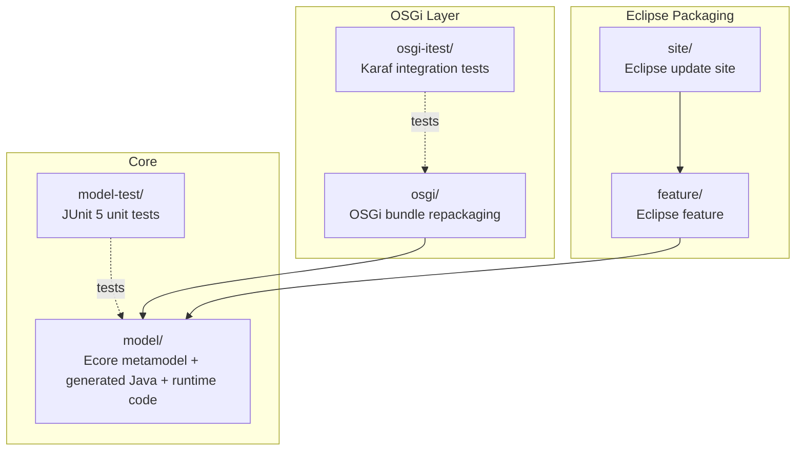
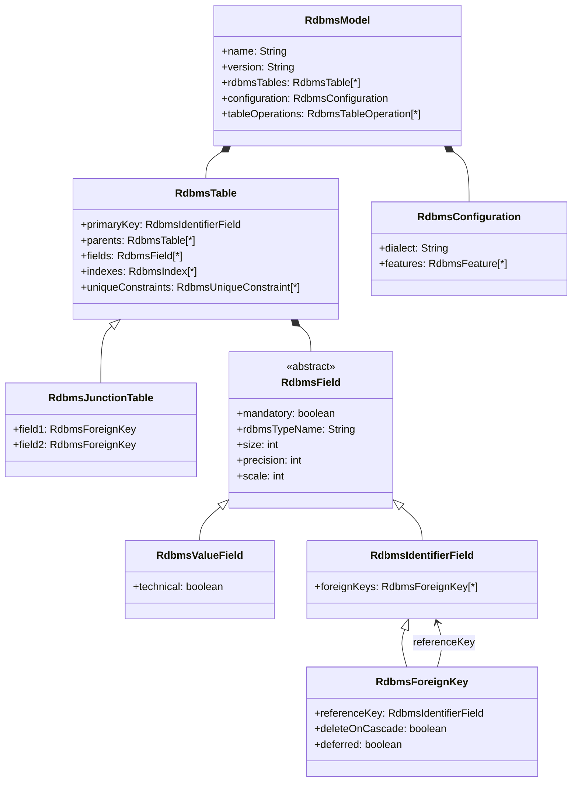
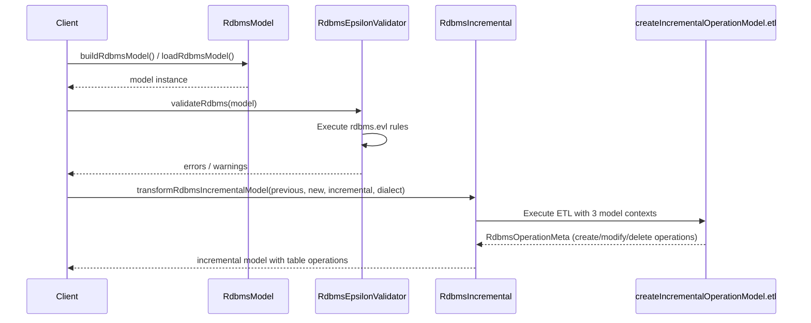
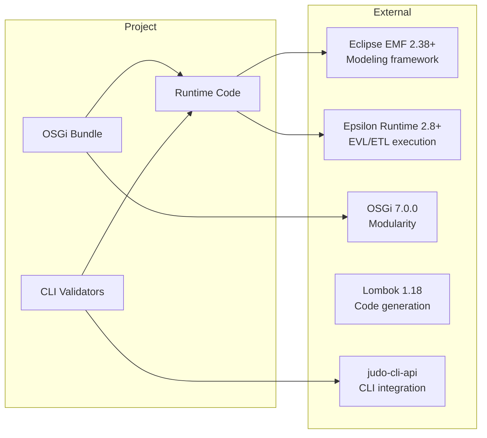

# judo-meta-rdbms

[](https://github.com/BlackBeltTechnology/judo-meta-rdbms/actions/workflows/build.yml)

## Introduction

judo-meta-rdbms is an EMF (Eclipse Modeling Framework) metamodel that describes relational database schemas within the JUDO ecosystem. It defines the structural elements of an RDBMS — tables, fields, foreign keys, indexes, constraints, and junction tables — and provides tooling for incremental schema evolution, model validation, and DDL generation via Liquibase.

The metamodel is packaged as an Eclipse plugin (with features and update sites), but also works standalone and in standard OSGi containers without Eclipse.

## Context

This project is a building block of the [judo-community](https://github.com/BlackBeltTechnology/judo-community) aggregator project. It sits in the model layer of the JUDO architecture, providing the RDBMS schema representation that downstream modules (like the Liquibase DDL generator) consume.

## Module Overview



## Metamodel Structure

The core metamodel (`model/model/rdbms.ecore`) defines the following key types:



Four Ecore files compose the full metamodel:

| Ecore File | Purpose |
|------------|---------|
| `rdbms.ecore` | Core model: tables, fields, keys, indexes, constraints, and incremental operations |
| `rdbms-datatypes.ecore` | Type mapping configuration (ASM types to RDBMS types with size/precision/JDBC info) |
| `rdbms-namemapping.ecore` | FQN-to-SQL name resolution mappings |
| `rdbms-tablemappingrules.ecore` | Rules for table relationship mapping (foreign keys, join tables, cascading) |

## Runtime Flow

The project provides three main runtime capabilities: model loading, validation, and incremental transformation.



## Build Commands

```sh
mvn clean install          # Full build
mvn clean test             # Run tests only
mvn clean install -DskipTests  # Build without tests
```

> **Note:** Maven wrapper is available (`./mvnw`).

## External Dependencies



## Contributing

See [CONTRIBUTING.md](CONTRIBUTING.md) for development setup, code structure, and submission guidelines.

## License

This project is licensed under the [Eclipse Public License 2.0](https://www.eclipse.org/legal/epl-2.0/).
